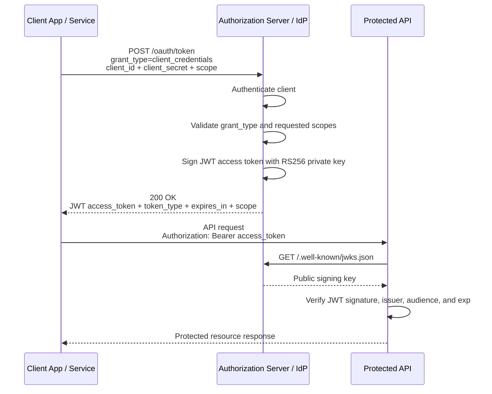

# OAuth2 Authorization Server

Minimal OAuth2 authorization server with support for the client credentials flow.

## Run

```bash
pnpm install
pnpm dev
```

Default server URL:

```text
http://127.0.0.1:3000
```

You can override the bind address:

```bash
HOST=127.0.0.1 PORT=4000 pnpm dev
```

Generate a stable local JWT signing key:

```bash
openssl genpkey -algorithm RSA -pkeyopt rsa_keygen_bits:2048 -out jwt-private.pem
```

Run with the stable signing key:

```bash
JWT_PRIVATE_KEY_PEM="$(cat jwt-private.pem)" \
JWT_KEY_ID=local-dev-key-1 \
OAUTH_CLIENT_ID=service-a \
OAUTH_CLIENT_SECRET="<client-secret>" \
OAUTH_CLIENT_SCOPES="users:read orders:read" \
pnpm dev
```

`JWT_PRIVATE_KEY_PEM`, `OAUTH_CLIENT_ID`, and `OAUTH_CLIENT_SECRET` are required. The app fails during startup if any of them are missing.

## Demo Client

```text
client_id: value from OAUTH_CLIENT_ID
client_secret: value from OAUTH_CLIENT_SECRET
allowed scopes: users:read orders:read
allowed grant types: client_credentials
```

Client authentication is supported only through request body fields:

```text
client_id
client_secret
```

HTTP Basic authentication is not supported.

## JWT Details

Access tokens are JWTs signed with `RS256`.

Current claims:

```text
iss: authorization server issuer URL
sub: client id
aud: protected-api
client_id: client id
scope: granted scopes
token_type: Bearer
iat: issued-at timestamp
exp: expiration timestamp
```

Use `JWT_PRIVATE_KEY_PEM` to provide a stable RSA private key. The server derives the JWKS public key from that private key and publishes it at `/.well-known/jwks.json`. This variable is required so issued JWTs remain verifiable across server restarts.

Use `JWT_KEY_ID` to set the JWT `kid` header and JWKS `kid` value. Resource servers use that `kid` to select the correct public key from JWKS.

## IdP Flow



## Endpoints

### GET /

Returns basic issuer metadata.

```bash
curl -i http://127.0.0.1:3000/
```

Example response:

```json
{
  "issuer": "http://127.0.0.1:3000",
  "token_endpoint": "http://127.0.0.1:3000/oauth/token",
  "introspection_endpoint": "http://127.0.0.1:3000/oauth/introspect",
  "jwks_uri": "http://127.0.0.1:3000/.well-known/jwks.json"
}
```

### GET /.well-known/jwks.json

Returns the JSON Web Key Set that resource servers can use to verify JWT access tokens.

```bash
curl -i http://127.0.0.1:3000/.well-known/jwks.json
```

Example response:

```json
{
  "keys": [
    {
      "kty": "RSA",
      "n": "<modulus>",
      "e": "AQAB",
      "kid": "auth-server-dev-key-1",
      "alg": "RS256",
      "use": "sig"
    }
  ]
}
```

### POST /oauth/token

Issues an access token using the OAuth2 client credentials flow.

Required form fields:

```text
grant_type=client_credentials
client_id=<client id>
client_secret=<client secret>
```

Optional form field:

```text
scope=<space separated scopes>
```

If `scope` is omitted, all scopes allowed for the client are granted.

Successful request:

```bash
curl -i \
  -d grant_type=client_credentials \
  -d client_id="$OAUTH_CLIENT_ID" \
  -d client_secret="$OAUTH_CLIENT_SECRET" \
  -d scope=users:read \
  http://127.0.0.1:3000/oauth/token
```

Example response:

```json
{
  "access_token": "<jwt>",
  "token_type": "Bearer",
  "expires_in": 3600,
  "scope": "users:read"
}
```

Decode the JWT header and payload locally:

```bash
node -e "const token = process.argv[1]; const [header, payload] = token.split('.'); console.log(JSON.parse(Buffer.from(header, 'base64url').toString())); console.log(JSON.parse(Buffer.from(payload, 'base64url').toString()));" "$ACCESS_TOKEN"
```

Request without explicit scope:

```bash
curl -i \
  -d grant_type=client_credentials \
  -d client_id="$OAUTH_CLIENT_ID" \
  -d client_secret="$OAUTH_CLIENT_SECRET" \
  http://127.0.0.1:3000/oauth/token
```

Invalid client:

```bash
curl -i \
  -d grant_type=client_credentials \
  -d client_id="$OAUTH_CLIENT_ID" \
  -d client_secret="<wrong-client-secret>" \
  http://127.0.0.1:3000/oauth/token
```

Expected response:

```json
{
  "error": "invalid_client",
  "error_description": "Client authentication failed."
}
```

Invalid scope:

```bash
curl -i \
  -d grant_type=client_credentials \
  -d client_id="$OAUTH_CLIENT_ID" \
  -d client_secret="$OAUTH_CLIENT_SECRET" \
  -d scope=admin \
  http://127.0.0.1:3000/oauth/token
```

Expected response:

```json
{
  "error": "invalid_scope",
  "error_description": "Client is not allowed to request: admin"
}
```

Unsupported grant type:

```bash
curl -i \
  -d grant_type=password \
  -d client_id="$OAUTH_CLIENT_ID" \
  -d client_secret="$OAUTH_CLIENT_SECRET" \
  http://127.0.0.1:3000/oauth/token
```

Expected response:

```json
{
  "error": "unsupported_grant_type",
  "error_description": "Only client_credentials is supported."
}
```

HTTP Basic is rejected:

```bash
curl -i \
  -u "$OAUTH_CLIENT_ID:$OAUTH_CLIENT_SECRET" \
  -d grant_type=client_credentials \
  http://127.0.0.1:3000/oauth/token
```

Expected response:

```json
{
  "error": "invalid_client",
  "error_description": "Client authentication failed."
}
```

### POST /oauth/introspect

Checks whether an access token is active.

Required form fields:

```text
client_id=<client id>
client_secret=<client secret>
token=<access token>
```

Issue a token and save it:

```bash
ACCESS_TOKEN=$(curl -s \
  -d grant_type=client_credentials \
  -d client_id="$OAUTH_CLIENT_ID" \
  -d client_secret="$OAUTH_CLIENT_SECRET" \
  -d scope=users:read \
  http://127.0.0.1:3000/oauth/token | node -pe "JSON.parse(fs.readFileSync(0, 'utf8')).access_token")
```

Introspect the token:

```bash
curl -i \
  -d client_id="$OAUTH_CLIENT_ID" \
  -d client_secret="$OAUTH_CLIENT_SECRET" \
  -d token="$ACCESS_TOKEN" \
  http://127.0.0.1:3000/oauth/introspect
```

Example active response:

```json
{
  "active": true,
  "iss": "http://127.0.0.1:3000",
  "sub": "service-a",
  "aud": "protected-api",
  "client_id": "service-a",
  "scope": "users:read",
  "token_type": "Bearer",
  "iat": 1788620491,
  "exp": 1788624091
}
```

Introspect an invalid token:

```bash
curl -i \
  -d client_id="$OAUTH_CLIENT_ID" \
  -d client_secret="$OAUTH_CLIENT_SECRET" \
  -d token=invalid-token \
  http://127.0.0.1:3000/oauth/introspect
```

Expected response:

```json
{
  "active": false
}
```

## Typecheck

```bash
pnpm exec tsc --noEmit
```
